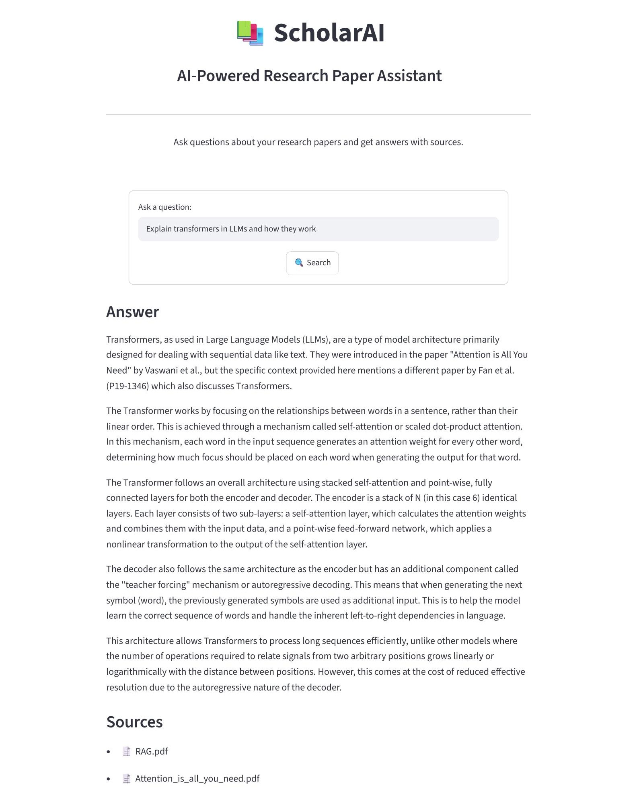
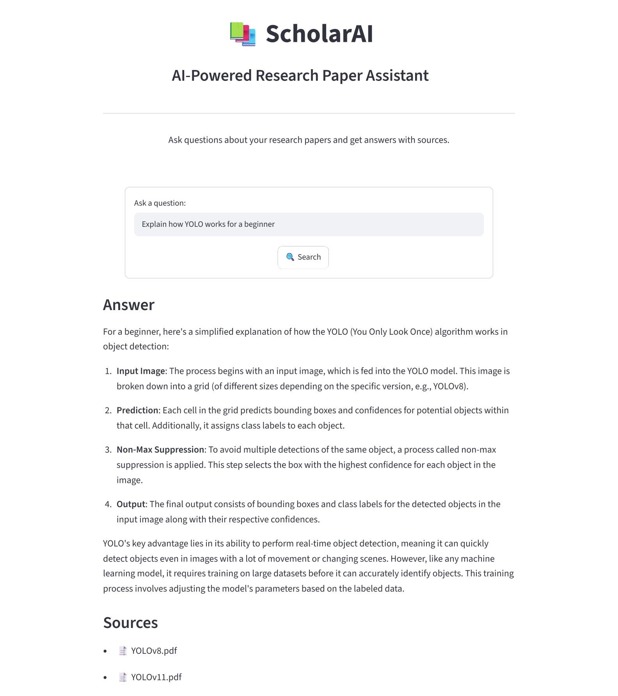
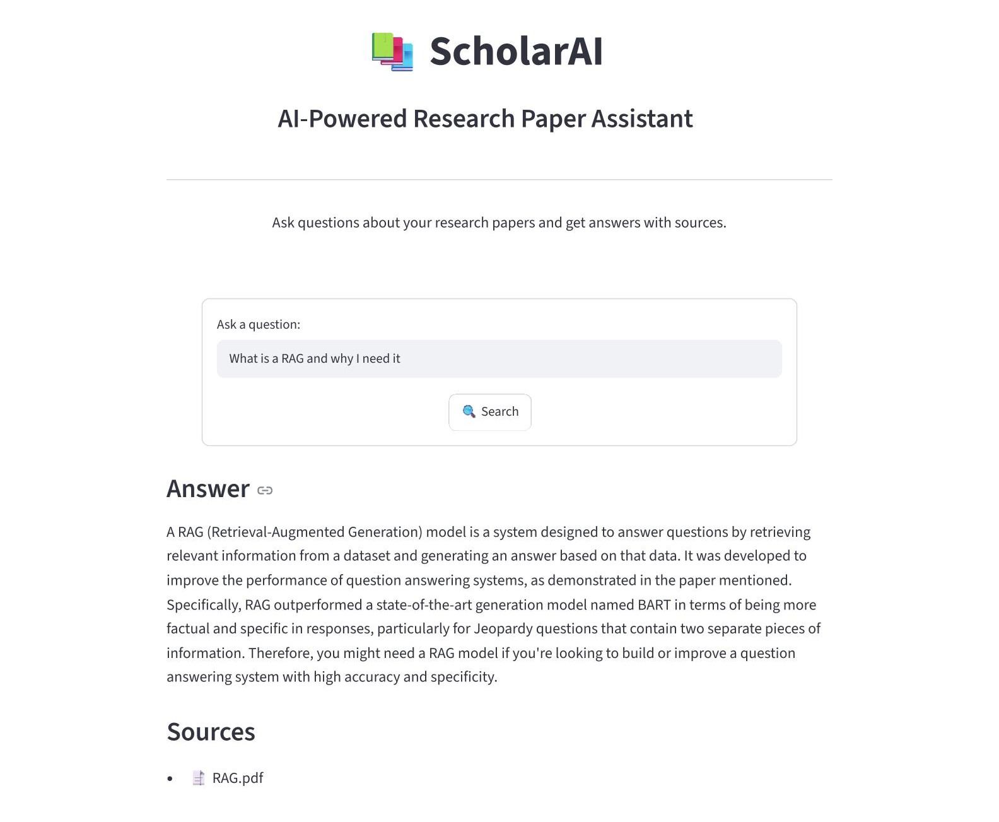
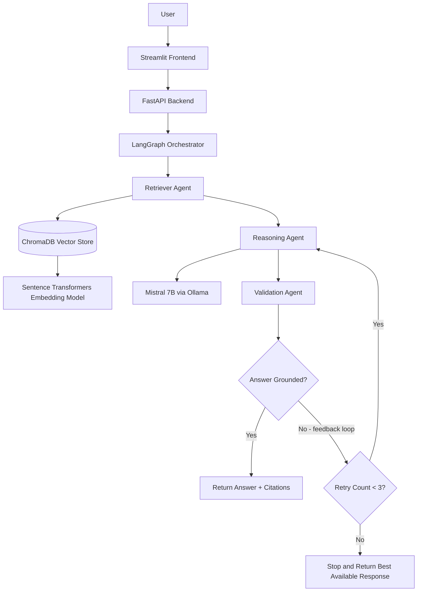

# 📚 ScholarAI 
## A Multi-Agent Retrieval-Augmented Generation (RAG) System

> Upload any document and ask questions in natural language. Specialized AI agents collaborate to retrieve, reason, and return grounded answers with source citations.


<!-- [](https://your-app-name.streamlit.app) -->


<!-- DEMO GIF — record a 20–40s screen capture of a live query and drop it here -->
<!--  -->

---

## 🧩 Problem Statement

Finding specific information across large document collections is slow and error-prone. Traditional keyword search misses semantically related content, and generic chatbots hallucinate answers without grounding them in your actual documents. Existing cloud-based solutions also require sending potentially sensitive documents to third-party APIs — a dealbreaker for companies handling confidential data.
 
This system lets users upload any PDF or text document and ask natural language questions. A multi-agent pipeline — built with LangGraph — routes each query to specialized agents: one retrieves the most relevant chunks from a vector store, another reasons over them using a local LLM, and a critic agent verifies the answer is grounded in the source material before returning it to the user. Every answer includes the source document and the passage it came from.
 
**The entire pipeline runs locally.** No document content, query, or answer ever leaves the user's machine. The LLM (Mistral 7B via Ollama), the embedding model, and the vector store all run on local hardware — making this suitable for organizations with strict data privacy requirements such as legal, healthcare, and finance teams.

**Success metric:** Answers are grounded in retrieved context. Ungrounded or low-confidence answers are flagged rather than surfaced.

---

## Evaluation and Testing
The system was tested using machine learning / deep learning / computer vision research papers as the document corpus to evaluate document ingestion, semantic retrieval, reasoning, and answer validation.

The papers that has been used [here](./src/data/). 

The documents were ingested, chunked, embedded using Sentence Transformers, and stored in ChromaDB. Queries were then evaluated through the multi-agent pipeline consisting of retrieval, reasoning, and validation agents.

### Example Test Results

#### Attention Is All You Need Paper

Query:
> Explain transformers in LLMs and how they work?

Result:
- Retrieved relevant sections from the papers.
- Generated a grounded answer using Mistral 7B.
- Validation Agent confirmed the answer was supported by the retrieved context.




#### YOLO Papers

Query:
> Explain how YOLO works for a beginner?

Result:
- Retrieved relevant architectural information.
- Reasoning Agent generated an answer grounded in the retrieved context.
- Validation Agent approved the response.



#### Retrieval-Augmented Generation Paper

Query:
> What is RAG and why I need it?

Result:
- Retrieved the sections explaining the motivation behind RAG.
- Reasoning Agent generated an answer based **only** on retrieved chunks.
- Validation Agent verified the answer before it was returned.



---

## 🏗️ Architecture



---

## ⚙️ Tech Stack

| Component | Technology | Why |
|---|---|---|
| Agent Orchestration | LangGraph | Stateful agent graphs with conditional routing — production standard for multi-agent systems |
| Vector Store | ChromaDB | Zero-infra setup, runs locally, fast enough for document-scale corpora |
| Embedding Model | `sentence-transformers` | Runs on local GPU, no API cost, strong semantic retrieval quality |
| LLM | Mistral 7B via Ollama | Runs fully local — no data sent to external APIs, strong instruction following for RAG tasks, zero inference cost |
| Backend | FastAPI | Async, typed, auto-generates API docs at `/docs` |
| Frontend | Streamlit | Rapid UI for ML demos |

---

## 🤖 Agent Design

The system uses three specialized agents coordinated by a LangGraph state machine:

**Retriever Agent** — Embeds the user query using `sentence-transformers`, retrieves the top-K most semantically similar chunks from ChromaDB, and passes them downstream with relevance scores.

**Reasoning Agent** — Receives the retrieved chunks and the original query. Constructs a grounded prompt and generates an answer using Mistral 7B via Ollama. Constrained to only use information present in the retrieved context.

**Validation Agent (Critic)** — Evaluates whether the generated answer is supported by the retrieved chunks. It acts as a conditional routing node in the LangGraph state machine with two possible outcomes:

- Grounded → The answer is returned to the user with source citations.
- Ungrounded → The Validation Agent sends corrective feedback to the Reasoning Agent, identifying issues and requesting regeneration based strictly on the retrieved context.

The Validation Agent and Reasoning Agent form a feedback loop that enables self-correction. To prevent infinite regeneration cycles, the system enforces a **maximum of 3 retry attempts**. If the answer remains ungrounded after the retry limit is reached, the workflow terminates instead of continuing indefinitely.

This controlled feedback mechanism improves answer reliability compared to a traditional RAG pipeline, which would blindly return the first generated response without verification.

---

## 📊 Evaluation (To be added later)

<!-- Run RAGAS eval and fill this in before submitting to jobs -->

| Metric | Score |
|---|---|
| Faithfulness | — |
| Answer Relevancy | — |
| Context Precision | — |

*Evaluation run on 25 domain-specific Q&A pairs using the [RAGAS](https://github.com/Yazan-ys202110319/Multi-Agent-RAG-System.git) framework. Scores will be updated after the next evaluation run.*

---

## 🚀 Running Locally

**Prerequisites:** Python 3.11+, [Ollama](https://ollama.com) installed and running, Mistral pulled locally.

```bash
# 1. Clone the repo
git clone https://github.com/Yazan-ys202110319/Multi-Agent-RAG-System.git
cd multi-agent-rag-system

# 2. Create and activate a virtual environment
python -m venv venv
source venv/bin/activate  # Windows: venv\Scripts\activate

# 3. Install dependencies
pip install -r requirements.txt

# 4. Pull the Mistral model via Ollama
ollama pull mistral

# 5. Start the FastAPI backend
uvicorn src.app.api:app --reload

# 6. In a separate terminal, start the Streamlit frontend
streamlit run frontend.py
```

The app will be available at `http://localhost:8501`. API docs at `http://localhost:8000/docs`.

---

## 📁 Project Structure

```
multi-agent-rag-system/
├── chroma_db/            # Persistent ChromaDB vector store (embedded document chunks)
│
├── notebooks/            # Jupyter notebooks for experiments and testing
│
├── notes/                # Project notes, ideas, and documentation drafts
│
├── src/
│   ├── agents/           # LangGraph agent definitions (retrieval, reasoning, validation)
│   ├── app/              # Application layer (FastAPI backend and Streamlit frontend)
│   ├── ingestion/        # PDF loading, parsing, and text chunking pipeline
│   ├── retrieval/        # Embedding generation and ChromaDB retrieval logic
│   └── generation/       # LLM generation utilities and prompts
│
├── .dockerignore         # Files excluded when building Docker images
├── .gitignore            # Files excluded from Git tracking
├── LICENSE              # Project license
├── README.md            # Project documentation
└── requirements.txt     # Python dependencies
```

---

## 🔮 Future Work

- **Streaming responses** — stream tokens to the frontend as they generate rather than waiting for the full answer
- **Pinecone migration** — replace local ChromaDB with Pinecone for persistent cloud-hosted vectors and scale beyond a single machine
- **Hybrid search** — combine dense vector retrieval with BM25 sparse retrieval for better recall on exact-match queries
- **Conversation memory** — persist chat history across sessions so follow-up questions have full context
- **Authentication** — add user sessions so multiple users can maintain separate document corpora
- **Docker deployment** — containerize the full stack for one-command deployment on any machine, removing the dependency on a local Ollama installation

---

## 📚 References

- [LangGraph Documentation](https://langchain-ai.github.io/langgraph/)
- [ChromaDB Documentation](https://docs.trychroma.com)
- [Ollama](https://ollama.com)
- [Sentence Transformers](https://www.sbert.net)
- [RAGAS — RAG Evaluation Framework](https://github.com/explodinggradients/ragas)
