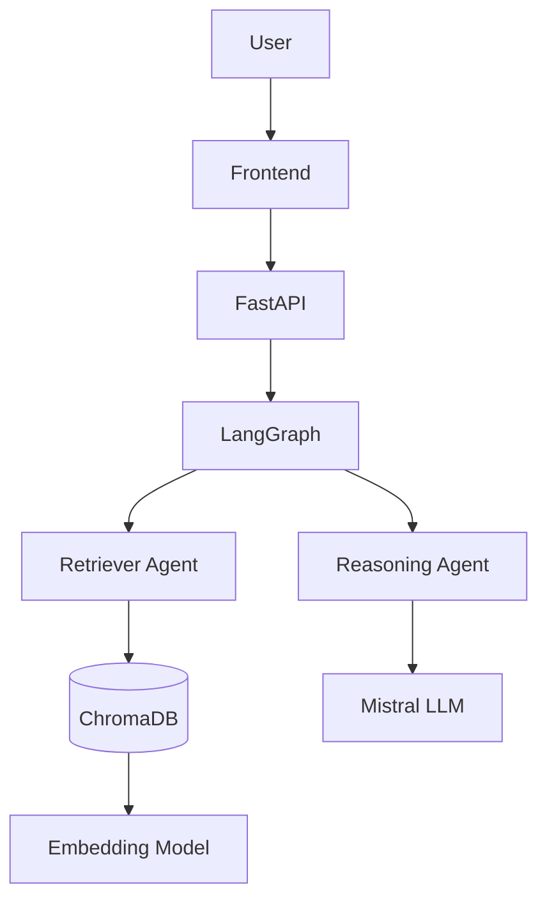

# Multi-Agent RAG System

High Level System Architecture

```mermaid
flowchart TD

    A[User] --> B[Frontend]
    B --> C[FastAPI]
    C --> D[LangGraph]

    D --> E[Retriever Agent]
    D --> F[Reasoning Agent]

    E --> G[(ChromaDB)]

    G --> H[Embedding Model]

    F --> I[Mistral LLM]
```