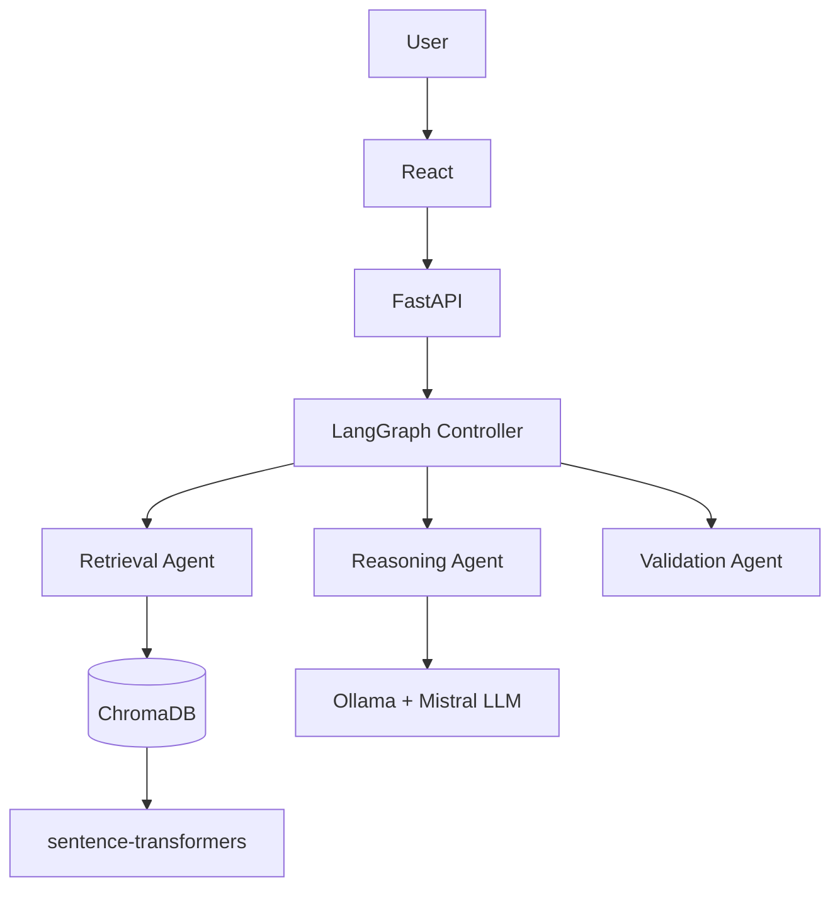

```mermaid
flowchart TD
    A[User] --> B[React]
    B --> C[FastAPI]
    C --> D[LangGraph Controller]

    D --> E[Retrieval Agent]
    D --> F[Reasoning Agent]
    D --> G[Validation Agent]

    E --> H[(ChromaDB)]
    H --> I[sentence-transformers]

    F --> J[Ollama + Mistral LLM]

```