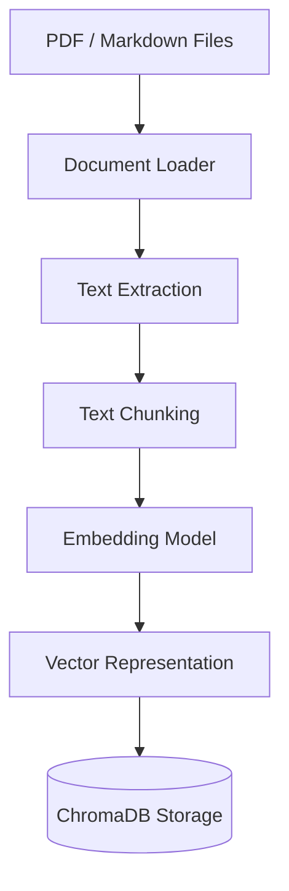

How documents enter the system

```mermaid
flowchart TD

    A[PDF / Markdown Files] --> B[Document Loader]
    B --> C[Text Extraction]
    C --> D[Text Chunking]
    D --> E[Embedding Model]
    E --> F[Vector Representation]
    F --> G[(ChromaDB Storage)]
```