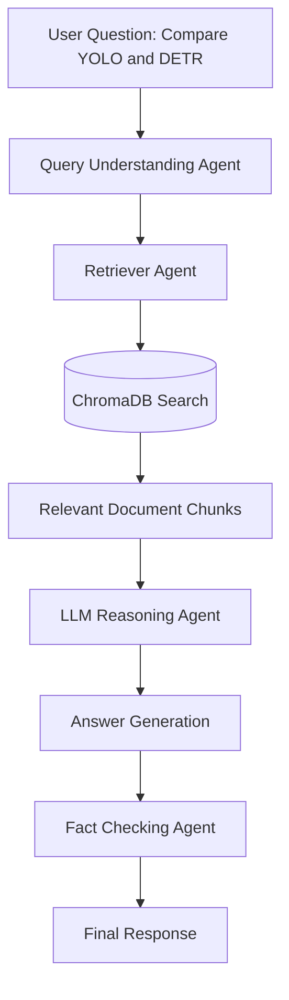

What happens when someone asks a question

```mermaid
flowchart TD

    A[User Question: Compare YOLO and DETR] --> B[Query Understanding Agent]
    B --> C[Retriever Agent]
    C --> D[(ChromaDB Search)]
    D --> E[Relevant Document Chunks]
    E --> F[LLM Reasoning Agent]
    F --> G[Answer Generation]
    G --> H[Fact Checking Agent]
    H --> I[Final Response]
```